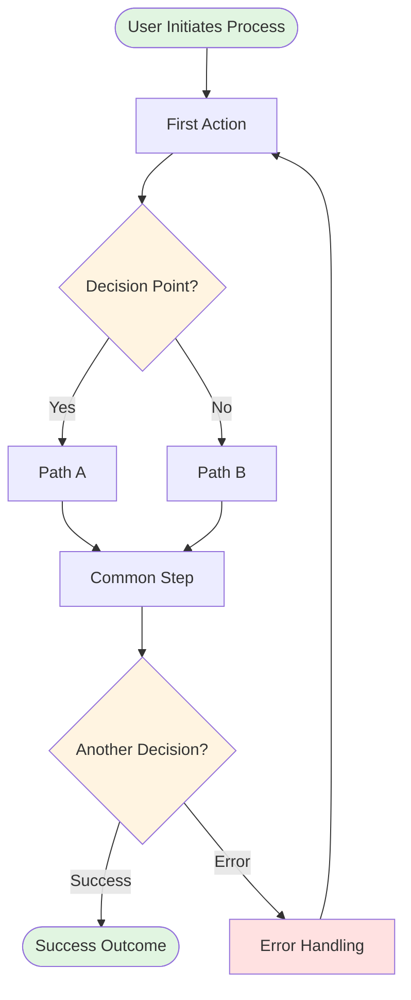

# Phase 2: Business Process Documentation

Transform the Phase 1 scenario analysis into comprehensive business process documentation for {{PROJECT_NAME}}.

## Input
- Phase 1 scenario analysis document (`.spec/prd/{slug}/phase1-scenarios.md`)
- Raw requirements (for context)

## Task

1. **Create Business Process Documentation**
   - Transform each scenario into a detailed business process description
   - Generate Mermaid flow diagrams for each process
   - Explain key decision points and alternative flows
   - Provide both Markdown and HTML outputs

2. **For Each Scenario Process**:
   - **Process Overview**: High-level description of the business process
   - **Flow Diagram**: Mermaid diagram showing the complete flow
   - **Step-by-Step Breakdown**: Detailed explanation of each step
   - **Decision Points**: Explain branching logic and conditions
   - **Error Handling**: What happens when things go wrong
   - **Success Outcomes**: What constitutes successful completion

3. **Output Formats**

Generate TWO files:

### File 1: Markdown Document (`phase2-business-doc.md`)

```markdown
# Business Process Documentation

## Document Information
- **Project**: {{PROJECT_NAME}}
- **Version**: 1.0
- **Date**: [Current date]
- **Status**: Draft for Review

## Executive Summary
[2-3 paragraphs summarizing:
- Overall business context
- Key processes covered
- Main stakeholders involved
- Expected business outcomes]

## Process Overview

### Process Map
[High-level overview of how all processes relate to each other]

---

## Process 1: [Scenario Name]

### Business Context
**Purpose**: [Why this process exists]
**Stakeholders**: [Who is involved]
**Frequency**: [How often this happens]
**Business Value**: [What value it delivers]

### Process Flow



### Process Steps

#### Step 1: [Step Name]
- **Actor**: [Who performs this step]
- **Action**: [What they do]
- **Input**: [What information/data is needed]
- **Output**: [What is produced]
- **Duration**: [Typical time to complete]

#### Step 2: [Step Name]
[Repeat for each step...]

### Decision Points

#### Decision 1: [Decision Name]
- **Condition**: [What determines the path]
- **Path A**: [What happens if condition is true]
- **Path B**: [What happens if condition is false]
- **Business Rules**: [Any rules that apply]

### Error Scenarios

#### Error 1: [Error Type]
- **Trigger**: [What causes this error]
- **Impact**: [What happens]
- **Resolution**: [How it's handled]
- **Prevention**: [How to avoid it]

### Success Criteria
- [ ] [Criterion 1]
- [ ] [Criterion 2]
- [ ] [Criterion 3]

### Metrics & KPIs
- **[Metric Name]**: [Description and target]
- **[Metric Name]**: [Description and target]

---

[Repeat for each process...]

## Cross-Process Integration

### Integration Points
- **[Process A] → [Process B]**: [How they connect]
- **[Process B] → [Process C]**: [How they connect]

### Shared Resources
- [Resource 1]: [Used by which processes]
- [Resource 2]: [Used by which processes]

### Dependencies
- [Dependency 1]: [Description]
- [Dependency 2]: [Description]

## Appendix

### Glossary
- **[Term 1]**: [Definition]
- **[Term 2]**: [Definition]

### Assumptions
- [Assumption 1]
- [Assumption 2]

### Constraints
- [Constraint 1]
- [Constraint 2]
```

### File 2: HTML Document (`phase2-business-doc.html`)

Create a professional HTML document with:
- Clean, modern styling
- Rendered Mermaid diagrams
- Table of contents with anchor links
- Print-friendly CSS
- Responsive layout
- Professional typography

Use this template structure:

```html
<!DOCTYPE html>
<html lang="zh-CN">
<head>
    <meta charset="UTF-8">
    <meta name="viewport" content="width=device-width, initial-scale=1.0">
    <title>Business Process Documentation - {{PROJECT_NAME}}</title>
    <script src="https://cdn.jsdelivr.net/npm/mermaid@10/dist/mermaid.min.js"></script>
    <style>
        /* Professional styling */
        * { margin: 0; padding: 0; box-sizing: border-box; }
        body {
            font-family: -apple-system, BlinkMacSystemFont, 'Segoe UI', Roboto, 'Helvetica Neue', Arial, sans-serif;
            line-height: 1.6;
            color: #333;
            max-width: 1200px;
            margin: 0 auto;
            padding: 40px 20px;
            background: #f5f5f5;
        }
        .container {
            background: white;
            padding: 60px;
            border-radius: 8px;
            box-shadow: 0 2px 8px rgba(0,0,0,0.1);
        }
        h1 { font-size: 2.5em; margin-bottom: 0.5em; color: #1a1a1a; border-bottom: 3px solid #007bff; padding-bottom: 0.3em; }
        h2 { font-size: 2em; margin-top: 1.5em; margin-bottom: 0.5em; color: #2c3e50; }
        h3 { font-size: 1.5em; margin-top: 1.2em; margin-bottom: 0.4em; color: #34495e; }
        h4 { font-size: 1.2em; margin-top: 1em; margin-bottom: 0.3em; color: #555; }
        p { margin-bottom: 1em; }
        ul, ol { margin-left: 2em; margin-bottom: 1em; }
        .toc { background: #f8f9fa; padding: 20px; border-radius: 4px; margin-bottom: 30px; }
        .toc ul { list-style: none; margin-left: 0; }
        .toc a { text-decoration: none; color: #007bff; }
        .toc a:hover { text-decoration: underline; }
        .process-section { margin-top: 40px; padding-top: 40px; border-top: 2px solid #e0e0e0; }
        .mermaid { background: #fafafa; padding: 20px; border-radius: 4px; margin: 20px 0; }
        .info-box { background: #e7f3ff; border-left: 4px solid #007bff; padding: 15px; margin: 15px 0; }
        .success-box { background: #e8f5e9; border-left: 4px solid #4caf50; padding: 15px; margin: 15px 0; }
        .warning-box { background: #fff3e0; border-left: 4px solid #ff9800; padding: 15px; margin: 15px 0; }
        .error-box { background: #ffebee; border-left: 4px solid #f44336; padding: 15px; margin: 15px 0; }
        table { width: 100%; border-collapse: collapse; margin: 20px 0; }
        th, td { padding: 12px; text-align: left; border-bottom: 1px solid #ddd; }
        th { background: #f8f9fa; font-weight: 600; }
        @media print {
            body { background: white; }
            .container { box-shadow: none; padding: 20px; }
            .process-section { page-break-before: always; }
        }
    </style>
</head>
<body>
    <div class="container">
        <h1>Business Process Documentation</h1>

        <div class="info-box">
            <strong>Project:</strong> {{PROJECT_NAME}}<br>
            <strong>Version:</strong> 1.0<br>
            <strong>Date:</strong> [Date]<br>
            <strong>Status:</strong> Draft for Review
        </div>

        <div class="toc">
            <h2>Table of Contents</h2>
            <ul>
                <li><a href="#executive-summary">Executive Summary</a></li>
                <li><a href="#process-overview">Process Overview</a></li>
                <li><a href="#process-1">Process 1: [Name]</a></li>
                <!-- Add more TOC items -->
            </ul>
        </div>

        <h2 id="executive-summary">Executive Summary</h2>
        <p>[Executive summary content...]</p>

        <h2 id="process-overview">Process Overview</h2>
        <p>[Overview content...]</p>

        <div class="process-section" id="process-1">
            <h2>Process 1: [Scenario Name]</h2>

            <h3>Business Context</h3>
            <table>
                <tr><th>Purpose</th><td>[Purpose]</td></tr>
                <tr><th>Stakeholders</th><td>[Stakeholders]</td></tr>
                <tr><th>Frequency</th><td>[Frequency]</td></tr>
                <tr><th>Business Value</th><td>[Value]</td></tr>
            </table>

            <h3>Process Flow</h3>
            <div class="mermaid">
                graph TD
                    Start([User Initiates]) --> Step1[Action]
                    Step1 --> End([Complete])
            </div>

            <h3>Process Steps</h3>
            [Step details...]

            <h3>Success Criteria</h3>
            <div class="success-box">
                <ul>
                    <li>[Criterion 1]</li>
                    <li>[Criterion 2]</li>
                </ul>
            </div>
        </div>

        <!-- Repeat for more processes -->

    </div>

    <script>
        mermaid.initialize({
            startOnLoad: true,
            theme: 'default',
            flowchart: { useMaxWidth: true, htmlLabels: true }
        });
    </script>
</body>
</html>
```

## Guidelines

- **Visual Clarity**: Diagrams should be easy to understand at a glance
- **Completeness**: Cover all scenarios from Phase 1
- **Business Language**: Avoid technical jargon, use business terms
- **Actionable**: Each step should be clear and actionable
- **Professional**: Suitable for executive and stakeholder review
- **Consistent**: Use consistent terminology and formatting throughout

## Mermaid Diagram Best Practices

- Use clear, concise node labels
- Color-code different types of nodes (start/end, decisions, errors)
- Keep diagrams readable (not too complex)
- Use subgraphs for complex processes
- Include legends if needed

## Output

Save both files to `.spec/prd/{slug}/`:
- `phase2-business-doc.md`
- `phase2-business-doc.html`

Both should contain complete, professional content ready for stakeholder review.
